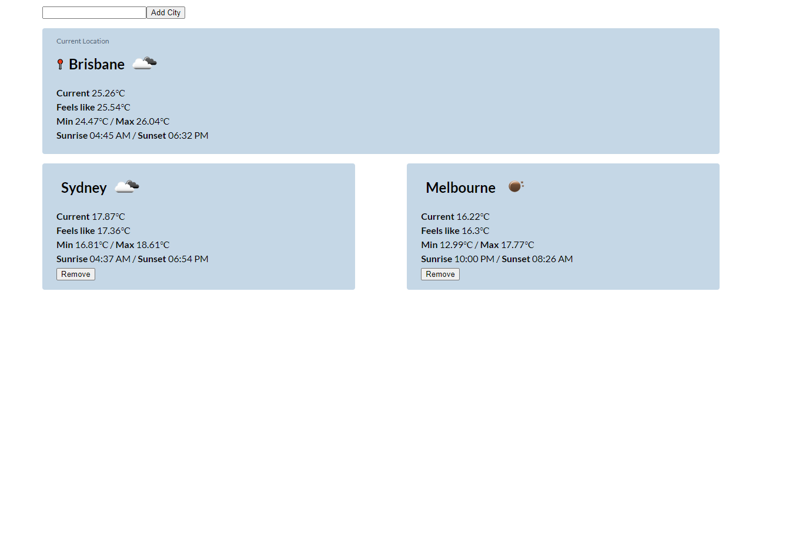

# React Weather App

A simple React SPA to view weather information for a particular city.

* Let user add/remove cities
* Display information about the weather in those cities
* Save data locally so user can re-open app and see the same cities he/she chosen before
* Includes an small API wrapper around OpenWeather using axios to avoid having ugly HTTP requests everywhere
* SCSS styling using BEM naming convention

## Installing

1. `npm install` or `yarn install`

## Running

1. Get an API key from OpenWeather & add as an environment variable `REACT_APP_OPENWEATHER_API_KEY=...`
2. Add the OpenWeather API URL environment variable `REACT_APP_OPENWEATHER_API_BASE=https://api.openWeathermap.org/data/2.5`
3. `npm run start` or `yarn start`

## Development

1. `npm run sass:watch` or `yarn sass:watch` for live Sass compiling
2. `npm run start` or `yarn start`